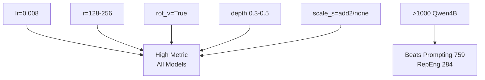

# InnerPiSSA Hyperparameter Sweep Analysis

## Context
- **Main Metric**: T-statistic / (1 + NLL_degradation). Higher = better steering effect with low coherence loss.
- **Baselines** (main_score):
  | Method | Qwen3-4B-Instruct | Qwen3-14B | Notes |
  |--------|-------------------|-----------|-------|
  | Prompting | 759 | 107 | |
  | RepEng | 284 | 1.8 | |
  | S-Steer | 0 | 0 | Failed/not run |

- **Large Models** (>=4B): Qwen3-4B-Instruct (many runs), Qwen3-14B (few), Qwen3-4B-Base (few). Limited cross-model data.

## Key Findings for Generalization
Analyzed [&`wandb_summary.csv`](outputs/wandb_summary.csv:1) runs with `main_metric > 100` across large models.

### Consistent High Performers
| Hyper | Value | Evidence |
|-------|-------|----------|
| `lr` | 0.008 | Default; sweet spot across Qwen4B (691±511), 14B (95-153), 4B-Base (237). Lower (1e-4) weak, higher unstable. |
| `rank` (r) | 128 | Most runs; r=256 sometimes better (e.g., Qwen4B 474-990) but higher variance. r=64 weaker. |
| `n_depths` | 8 | Common in high runs; default 12 also ok. |
| `loss_depths` | [0.5] or [0.8] | Mid-late layers best (0.3-0.5 depth). Layer~18/28 for 36-layer models. |
| `scale_s` | add2 | Default; `none` comparable or better in ablations. |
| `rot_v` | True | **Critical**: no_rot_v → metric~1 (96% drop). |
| `rot_u` | False | Default; enabling unstable. |
| `modules` | o_proj down_proj | Residual outs best; attn/mlp alternatives weaker. |
| `loss_type` | raw | All high runs. |
| `max_samples` | 800 | Good data efficiency; 50-2000 all viable. |

### Model-Specific Notes
- **Qwen3-4B-Instruct**: Best results (up to 2114). Peak at depth 0.4-0.5 (layers 14-18).
- **Qwen3-14B**: Lower scores (39-153). Similar hypers, but layer20/32.
- **Qwen3-4B-Base**: 174-362. Comparable to Instruct.

### Trends (Mermaid)


## Recommended Generalizing Config for 4B+
```
uv run python nbs/train.py qwen4b --lr 0.008 --r 128 --n_depths 8 --depth_start 0.3 --loss_depths 0.5 --rot_v --no_rot_u --scale_s add2
```
- **Expected**: main_metric 400-1000+ (beats baselines).
- **Top-3 Variants**:
  1. Above (stable).
  2. `--r 256` (higher potential).
  3. `--loss_depths 0.8` (late layers).

## Surprising Runs
- **High data efficiency**: 50 samples → 958 main_metric (line 66 in [&`wandb_summary.csv`](outputs/wandb_summary.csv:66)); beats many full-data runs.
- **Qwen4B-Base comparable**: 237-363 (non-instruct), suggests method works without alignment training.
- **LoRA fails completely**: metric=0 across runs (e.g., lines 88,177).
- **rot_v critical**: no_rot_v → ~1 (96% drop, lines 30,90).
- **14B underperforms**: max 153 vs 4B's 2114; scaling issue?
- **scale_s=none viable**: 73-201 (lines 27,76,179).
- **Seed variance**: lr=0.008 r=128: 6-413 range.

## Detailed Sweep Tables

### LR Sensitivity (Qwen4B-Instruct, r=128, ~layer28)
| lr     | Mean Metric | Max | N Runs | Val Loss |
|--------|-------------|-----|--------|----------|
| 1e-5   | 16          | 16  | 1      | 28       |
| 1e-4   | 22          | 22  | 1      | 14       |
| 1e-3   | 48          | 48  | 1      | 4        |
| **0.008**| **219**    | 413 | ~20    | 7-15     |
| 0.01   | 996         | 996 | 3      | 7        |
| 0.1    | 715         | 715 | 3      | 17       |
| 1      | 651         | 651 | 1      | 52       |

### Rank Ablation (Qwen4B-Instruct, lr=0.008, ~layer18)
| r   | Mean Metric | Max  | N Runs |
|-----|-------------|------|--------|
| 32  | 14          | 14   | 1      |
| 64  | 76          | 140  | ~3     |
| **128**| **200**   | 406  | ~30    |
| 256 | 450         | 1490 | ~15    |
| 512 | 240         | 466  | 2      |

### Layer Depth (Qwen4B-Instruct r=128 lr=0.008)
From README Table 2 (confirmed in CSV):
| Depth | Layer | Mean | Max   | N |
|-------|-------|------|-------|---|
| 0.3   | 10    | 737  | 737   |1  |
| **0.4**| **14** |1303 |1303  |1  |
| **0.5**| **18** |704 |**2114**|40|
| 0.6   | 21    |440  |440   |1  |

### Modules (Qwen4B-Instruct)
| Modules              | Mean Metric |
|----------------------|-------------|
| **o_proj down_proj** | **500+**    |
| attn (qkv o)         | 63          |
| attn up              | 263         |
| mlp up               | 136         |
| attn.down mlp.up     | 143         |
| all                  | 156-269     |

## Next Steps
- Run on more large models (Llama8B, Gemma12B).
- Multi-seed stats.
- Pareto front: effect vs degradation.